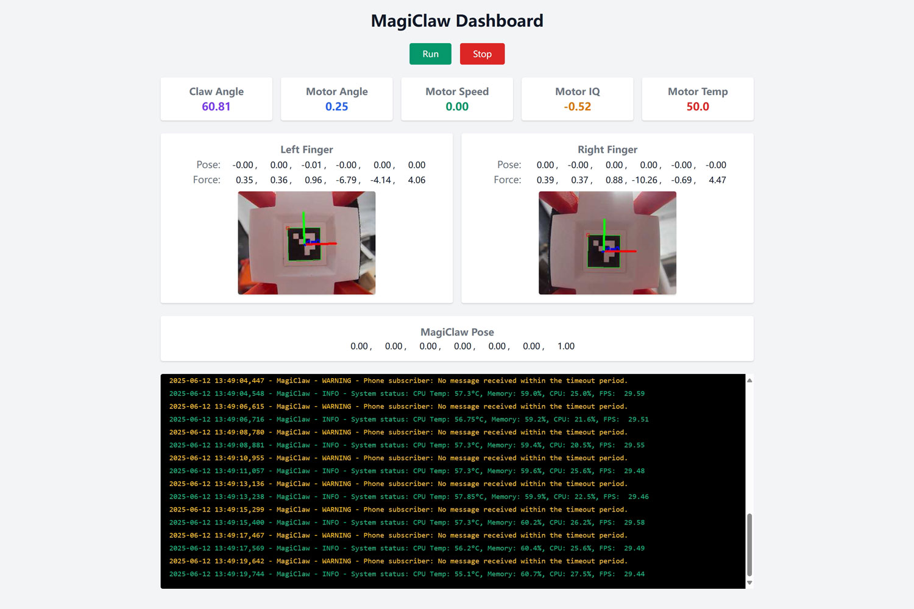

<p align="center">
  <br>
</p>
<h1 align="center">MagiClaw Dashboard</h1>

<p align="center">
  
  
  
  
</p>

This repository contains an real-time web interface for controlling and monitoring the **[MagiClaw](https://github.com/han-xudong/magiclaw)**.

## 🚀 Installation

To set up the MagiClaw Dashboard, first clone the repository:

```bash
git clone https://github.com/asMagiClaw/magiclaw-dashboard.git
cd magiclaw-dashboard
```

It's recommended to use the same conda environment as the MagiClaw project to ensure compatibility. Then, install the required dependencies using pip:

```bash
pip install -r requirements.txt
```

## 🔧 Service Setup

To make the dashboard as a daemon system service, create a systemd service file `/etc/systemd/system/magiclaw-dashboard.service` and paste the following content:

```ini
[Unit]
Description=MagiClaw Dashboard Web Server
After=network.target

[Service]
ExecStart=/path/to/python app.py
WorkingDirectory=/path/to/magiclaw-dashboard
Restart=always
User=pi
Environment="PYTHONUNBUFFERED=1"

[Install]
WantedBy=multi-user.target
```

Note that you need to replace `/path/to/python` with the path to your Python interpreter and `/path/to/magiclaw-dashboard` with the path to the cloned repository.

After creating the service file, enable and start the service:

```bash
sudo systemctl daemon-reload
sudo systemctl enable magiclaw-dashboard.service
sudo systemctl start magiclaw-dashboard.service
```

## 🌐 Usage

Once the service is running, you can access the dashboard by navigating to `http://<raspberry_pi_ip_or_host>:8000` in your web browser. Replace `<raspberry_pi_ip_or_host>` with the actual IP address or hostname of your Raspberry Pi.

<p align="center">  </p>

## 📄 License

This repository is licensed under the [MIT License](LICENSE).
